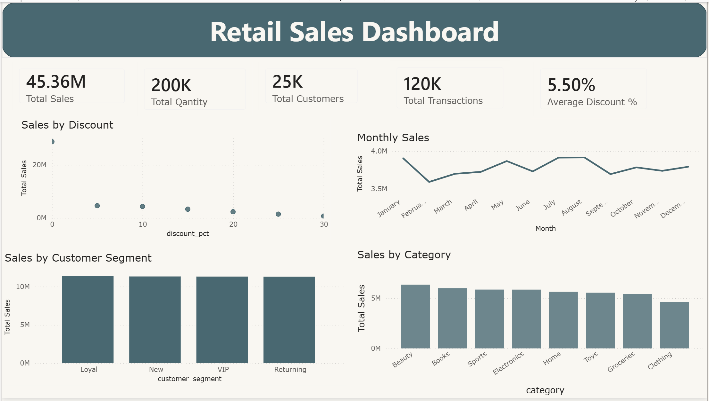

# Retail Sales Analysis

## Project Overview

This project analyzes retail sales data using **Microsoft Excel** and **Power BI** to understand sales performance, customer segments, product categories, and sales trends.

## Dataset

The dataset was obtained from [Kaggle](https://www.kaggle.com/datasets/noopurbhatt/retail-sales-dataset).

- **Rows:** 120,000
- **Columns:** 17

## Data Preparation – Excel

Microsoft Excel was used for **data cleaning and validation**:

- Checked for missing values
- Checked for duplicate transactions
- Verified data types
- Checked categorical values for consistency
- Checked numerical values for invalid entries

## Analysis & Dashboard – Power BI

Power BI was used for **data analysis, DAX calculations, and visualization**.

The dashboard includes:

- Total Sales
- Total Quantity
- Total Transactions
- Total Customers
- Average Discount
- Monthly Sales
- Sales by Category
- Sales by Customer Segment
- Sales by Discount

## Key Insights

- **Beauty** has the highest sales, while **Clothing** has the lowest.
- Sales are relatively balanced across regions.
- Sales are similar across customer segments.
- Monthly sales remain relatively stable.
- **0% discount** has the highest total sales.

## Tools

- Microsoft Excel
- Power BI
- Power Query
- DAX

## Dashboard

